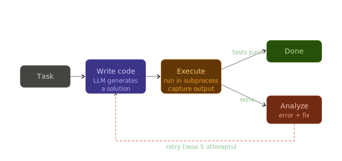

# Coding Agent

An autonomous agent that writes code, runs tests, reads the error output, fixes the code, and repeats -- until the tests pass or the task is done. No human in the loop.



## Setup

### Prerequisites
- [uv](https://docs.astral.sh/uv/getting-started/installation/) installed
- A [Gemini API key](https://aistudio.google.com/app/apikey)

### Install & Run

```bash
# Clone / navigate to the project
cd coding-agent

# Create virtual environment and install dependencies
uv sync

# Add your Gemini API key
copy .env.example .env
# Then open .env and replace the placeholder with your actual key

# Use the agent to write a new module from scratch
uv run python main.py "Write a basic implementation of a binary search tree in bst.py and tests in test_bst.py"

# Or use the agent to fix the provided buggy file
uv run python main.py "Fix the math_utils.py file to pass the test_math.py tests"
```

## How the Pipeline Works

```text
User asks for a feature or bug fix
    │
    ▼
Agent reads the task
    │
    ▼
list_files() & read_file()  ◄── Agent looks around the folder to see what it has
    │
    ▼
write_file() ◄── Agent writes new code or fixes existing code
    │
    ▼
run_tests()  ◄── Agent runs tests to check if the code actually works
    │
    ▼
Tests FAIL ──► Agent reads the error message ──► Loops back up to fix the code
    │
    ▼
Tests PASS
    │
    ▼
Agent finishes the task and stops
```

## Learnings

### What is an Autonomous Agent Loop?

Most advanced AI coders (like Devin or Cursor) use this exact same pattern: Write code, run it, see what happens, and fix it. The AI doesn't stop trying until the code actually works perfectly.

### Key Concepts 

1. **Observe-Fix Cycle:** The AI doesn't just guess. If its code breaks, it reads the explicit red error messages (the traceback) so it knows exactly what to fix on its next try.
2. **Circuit Breaker:** We give the AI a maximum number of tries (like 15). If we didn't do this, a confused AI could get stuck in an endless loop forever, wasting time and API costs.
3. **Sandboxing:** We run the AI's code through a separate, isolated background process. That way, if the AI accidentally writes an infinite loop or crashes, our main program won't crash with it.
4. **Error Feedback:** For an AI to be smart, it needs clear instructions. Giving it failing tests with clear error outputs is the best way to help it self-correct.
