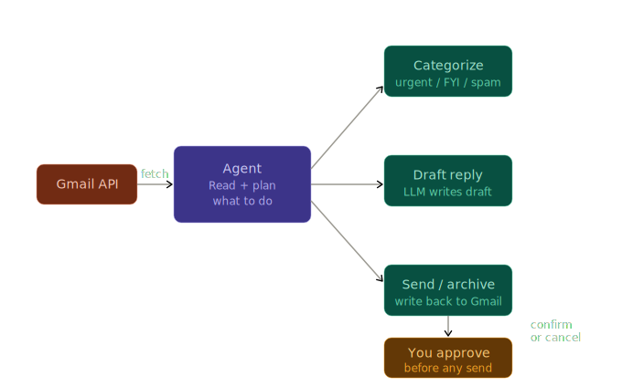

# Email Agent

A Gmail agent that reads your inbox, understands what each email is about, and takes actions — with your approval before anything irreversible happens.

Built with Python, Gemini API, and the Gmail API.



## Setup

### Prerequisites
- [uv](https://docs.astral.sh/uv/getting-started/installation/) installed
- A [Gemini API key](https://aistudio.google.com/app/apikey)
- A Google Cloud project with the Gmail API enabled

### 1. Enable Gmail API

1. Go to [Google Cloud Console](https://console.cloud.google.com)
2. Create a new project (or select an existing one)
3. Go to **APIs & Services → Library** and enable **Gmail API**
4. Go to **APIs & Services → Credentials**
5. Click **Create Credentials → OAuth 2.0 Client ID**
6. Application type: **Desktop app**
7. Download the JSON file and rename it to `credentials.json`
8. Place `credentials.json` in the project root

### 2. Install & configure

```bash
cd email-agent

uv sync

copy .env.example .env
# Open .env and add your Gemini API key
```

### 3. First run (OAuth)

```bash
uv run python main.py --dry-run --max 5
```

A browser window will open asking you to grant Gmail access. After you approve, a `token.json` file is saved and reused for all future runs.

> [!WARNING]
> Never commit `credentials.json` or `token.json` to git. They are already in `.gitignore`.

### Usage

```bash
# Categorize last 20 emails, then go through each one interactively
uv run python main.py

# Process only 10 emails
uv run python main.py --max 10

# Dry-run — categorize and show proposed actions, execute nothing
uv run python main.py --dry-run

# Auto-archive newsletters, confirm everything else
uv run python main.py --auto-archive
```


## Learnings

### Why human-in-the-loop matters

Sending an email you didn't mean to, or archiving something important, is a mistake with real consequences. This agent follows a simple rule:

> Every irreversible action requires explicit `y` from you. The default is always `n`.

This single pattern — propose, confirm, execute — is what separates a safe agent from a dangerous one. Production systems at companies like Cursor and Cognition all have approval flows for high-stakes actions.

### Structured output from LLMs

Getting an LLM to return clean, parseable JSON every time is a core skill. This agent sends all emails in one batch and gets back a structured array:

```json
[
  {
    "id": "...",
    "category": "action_required",
    "summary": "Invoice #1234 due Friday",
    "priority": 8,
    "needs_reply": true,
    "suggested_action": "reply"
  }
]
```

If parsing fails, the agent falls back gracefully instead of crashing.

### OAuth and external API integration

The LLM part of any agent takes 10 lines to write. The integration work — OAuth scopes, credential flows, API pagination, MIME encoding — is where the real time goes. This project is a good example of that reality.

| Scope | Why it's needed |
|---|---|
| `gmail.readonly` | Read inbox and message content |
| `gmail.send` | Send replies |
| `gmail.modify` | Archive and apply labels |

### How the pipeline works

```
Gmail inbox
     │
     ▼
fetch_emails()  ──► list of emails (subject, sender, body)
     │
     ▼
categorize_emails()  ──► Gemini (one batch call, structured JSON)
     │
     ▼
Summary table in terminal
     │
     ▼
Action loop — for each email:
  ├── Draft reply? ──► show draft ──► confirm ──► send
  ├── Archive?     ──►              confirm ──► archive
  └── Label?       ──►              confirm ──► apply label
```
