# MCP Project Manager

An autonomous project manager that monitors tasks, posts updates to Slack, and writes reports — all on its own schedule. Once it starts, it keeps your team informed without you doing anything.

Built with Python, Gemini API, and plug-in tools via MCP (Model Context Protocol).


## Setup

### Prerequisites

- [uv](https://docs.astral.sh/uv/getting-started/installation/) installed
- A [Gemini API key](https://aistudio.google.com/app/apikey)
- MCP servers for Notion and Slack running locally (or available at configured URLs)

### 1. Install & configure

```bash
cd mcp-project-manager

uv sync

copy .env.example .env
# Open .env and add your Gemini API key
```

### 2. Start MCP servers

Before running the manager, start the Notion and Slack MCP servers in separate terminals.

```bash
# Terminal 1: Start Notion MCP
# Terminal 2: Start Slack MCP
```

### 3. Run the manager

```bash
uv run python main.py
```

The manager will start and run automatically:
- **Morning (9 AM):** Posts a standup with today's tasks
- **Every 30 minutes:** Monitors for blocked tasks and alerts the team
- **Evening (5 PM):** Publishes an end-of-day report

## Usage

Once running, the manager works on its schedule. It posts to Slack automatically.

To customize when things run, edit `.env`:

```bash
MORNING_STANDUP_HOUR=9              # Change standup time (0-23)
END_OF_DAY_REPORT_HOUR=17           # Change report time (0-23)
TASK_MONITOR_INTERVAL_MINUTES=30    # How often to check tasks
TIMEZONE=UTC                        # Your timezone
```

The manager restarts at any time. It will pick up schedule changes from your `.env` on the next run.

## Learnings

### MCP is the plug-in model agents have been waiting for

Before MCP, connecting a tool to an agent meant writing custom code. Gmail needed Gmail code. Slack needed Slack code. Notion needed Notion code. You wrote all of it, for every agent.

MCP (Model Context Protocol) is a standard plug. Every tool ships an MCP server. The agent plugs into the server and asks for tools. No custom code. This is why every company (Notion, Slack, GitHub, Linear) is shipping MCP servers now — it's the future of how agents connect to the world.

### Tool discovery beats hardcoding

Old way: You hardcoded what tools the agent can use. Want to add a new tool? Rewrite code.

New way: When the agent starts, it asks the MCP servers "what tools do you have?" and gets the list. Update the MCP server? Agent automatically has the new tools. Zero code changes.

This is extensibility. One agent, pluggable tools.

### Scheduling turns a tool into a product

A manual agent is a toy. You run it, it does something, you stop it. A scheduled agent is a product. It runs every morning. It checks every 30 minutes. It reports every evening. No human intervention.

The scheduler (APScheduler) is just a clock. But that clock is what transforms a one-off tool into a system your team relies on. That's the difference between hobby projects and production systems.

### Async is required at scale

Network calls are slow. If the agent had to wait for one MCP call to finish before starting the next, everything would be slow.

Async means the agent can talk to Notion and Slack at the same time, then wait for both replies. Network-heavy operations run in parallel instead of serial. This is essential when you have multiple tools and can't afford to block.

### Graceful failure keeps the system alive

When an MCP server goes down or a Slack post fails, this agent doesn't crash. It logs the error and keeps going. Tomorrow's standup still happens. Next report still publishes.

This is the baseline for production systems — they degrade gracefully. One failed component doesn't kill the whole thing.

### The integration layer is harder than the AI

The Gemini part is easy. It's <50 lines of code. The hard parts are:
- Connecting securely to MCP servers
- Error handling when tools fail
- Scheduling with timezones and retries
- Making sure the agent's output is actually useful

This project shows that 90% of agent complexity is integration work, not AI work.
