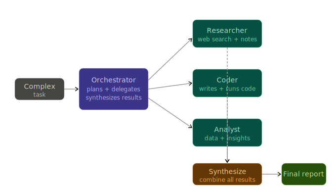

# Multi-Agent Pipeline

An orchestrator-worker agent system that decomposes complex tasks and dispatches them to specialist workers running in parallel.

Just Python, Gemini API, LangGraph, and LangSmith.
 
## Setup

### Prerequisites
- Python 3.11+
- [Google Gemini API key](https://aistudio.google.com/app/apikey)
- (Optional) [LangSmith API key](https://smith.langchain.com/) for tracing


### Install & Run

```bash
# Navigate to the project
cd multi-agent-pipeline

# Create virtual environment and install dependencies
python -m venv .venv
.venv\Scripts\activate  # Windows
# source .venv/bin/activate  # Linux/Mac

pip install -e .

# Configure environment
copy .env.example .env
# Edit .env and add your API keys

# Run a task
python main.py "Research Python async patterns, write a concurrent web scraper, and analyze performance bottlenecks"
```

## How It Works

The system uses an **orchestrator-worker pattern** with parallel execution:

1. **Decompose**: Orchestrator breaks complex task into subtasks with worker assignments
2. **Delegate**: Workers execute subtasks in parallel (research, code, analyze)
3. **Synthesize**: Orchestrator combines results into coherent final output

### Architecture

- **Orchestrator**: Task decomposition and result synthesis (LangGraph)
- **Workers**: Specialized agents (Research, Coder, Analyst)
- **Parallel Execution**: ThreadPoolExecutor with configurable concurrency
- **Observability**: LangSmith tracing for full pipeline visibility

### Workers

- **Research**: Finds information, sources, and documentation
- **Coder**: Generates code with best practices
- **Analyst**: Analyzes data and provides insights

## Example

```bash
python main.py "Explain how generators work in Python and write an example iterator class"
```

The orchestrator will:
- Assign research worker to explain generators
- Assign coder worker to write iterator example
- Execute both in parallel
- Synthesize into a comprehensive answer

## Learnings

### What is the Orchestrator-Worker Pattern?

Instead of one AI agent trying to do everything, we split work into **specialized roles**:

| Component | What it does |
|---|---|
| **Orchestrator** | Breaks down complex tasks into smaller pieces and decides which worker handles each piece |
| **Workers** | Specialized agents that focus on one thing (research, coding, or analysis) |
| **Parallel Execution** | Multiple workers run at the same time instead of waiting for each other |
| **Synthesis** | Orchestrator combines all worker results into one coherent answer |

Think of it like a restaurant kitchen: the head chef (orchestrator) splits an order into prep, cooking, and plating, then different cooks (workers) handle each part simultaneously.

### Why Parallel Execution Matters

**Sequential (slow):**
```
Research (30s) → Code (30s) → Analyze (30s) = 90 seconds total
```

**Parallel (fast):**
```
Research (30s) ┐
Code (30s)     ├─→ All finish at 30s
Analyze (30s)  ┘
```

Using `ThreadPoolExecutor`, workers run simultaneously. A task that would take 90 seconds sequentially completes in ~30 seconds.

### How Task Decomposition Works

The orchestrator uses an LLM to **reason** about how to split tasks:

```
User: "Research Python async and write example code"
         ↓
Orchestrator LLM analyzes and creates:
  ├─ Subtask 1: "Explain async/await" → Research worker
  └─ Subtask 2: "Write async example" → Coder worker
         ↓
Both workers execute in parallel
         ↓
Orchestrator synthesizes results into final answer
```

Each subtask includes a `reasoning` field explaining why that worker was chosen. This chain-of-thought approach improves task assignment quality.

### LangGraph for Orchestration

LangGraph provides a **state machine** for the workflow:

```
┌──────────┐
│ User Task│
└────┬─────┘
     ↓
┌──────────────┐
│  Decompose   │  Creates subtasks with worker assignments
└──────┬───────┘
       ↓
┌──────────────┐
│   Delegate   │  Runs workers in parallel with retry logic
└──────┬───────┘
       ↓
┌──────────────┐
│  Synthesize  │  Combines results into final output
└──────┬───────┘
       ↓
┌──────────────┐
│ Final Answer │
└──────────────┘
```

Each node is a function, and LangGraph handles state passing between them.

### Error Handling Strategy

**Retry-once-then-partial-synthesis** means:

1. If a worker fails → retry it once
2. If retry also fails → continue with partial results
3. Synthesis acknowledges the failure and works with what's available

This is better than:
-  Failing the entire task 
-  Ignoring errors silently 
-  Graceful degradation with transparency


### Key Concepts Used

- **ThreadPoolExecutor** — Python's built-in library for parallel execution (simple and proven)
- **LangGraph StateGraph** — Defines the orchestration flow with nodes and edges
- **System Instructions** — Each worker and the orchestrator have specialized prompts for their role
- **LangSmith Tracing** — Optional observability to see exactly what happened at each step
- **Worker Isolation** — Workers don't share state, making them safe to run in parallel
- **Configurable Concurrency** — `MAX_WORKERS` environment variable controls parallel execution limit

