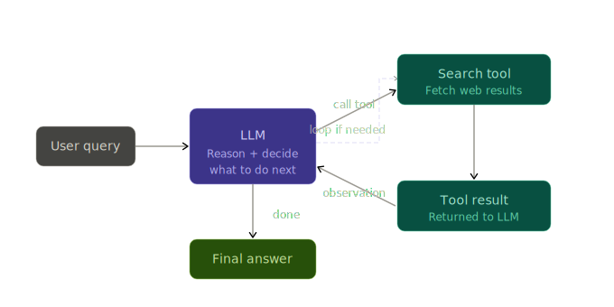

# Web Search Agent — ReAct Pattern

A minimal agentic AI that decides **when** to search the web, does it, observes the results, and loops, until it can confidently answer your question.

This implements the **ReAct (Reason + Act)** pattern using the Gemini API and DuckDuckGo search.




## Setup
### Prerequisites
- [uv](https://docs.astral.sh/uv/getting-started/installation/) installed
- A [Gemini API key](https://aistudio.google.com/app/apikey)

### Install & Run

```bash
#  Clone the project
cd web-search-agent

# Create virtual environment and install dependencies
uv sync

#  Add your Gemini API key
copy .env.example .env
# Then open .env and replace the placeholder with your actual key

#  Run the agent
cd src
uv run python agent.py
```


## Learnings

### What is ReAct?

**ReAct = Reason + Act** — a prompting pattern where an LLM alternates between:

| Phase | What happens |
|---|---|
| **Observe** | Receive the user query (or tool result) |
| **Think** | Reason about what to do next |
| **Act** | Call a tool (or produce a final answer) |

The loop repeats until the model decides it has enough information to respond.

### Why it matters

Without ReAct, an LLM is stateless — it answers from training data alone. With ReAct:

- The model **decides autonomously** whether it needs external info
- It can **chain multiple tool calls** — e.g., search → refine search → answer
- The decision boundary stays inside the model — your code just dispatches what it asks for

### How this agent works

```
User query
    │
    ▼
Gemini (+ tool declaration attached)
    │
    ├── function_call? ──Yes──► execute web_search() ──► feed result back ──┐
    │                                                                        │
    │◄───────────────────────────────────────────────────────────────────────┘
    │
    └── No function call ──► Final answer +  Tool used N time(s)
```

### Key concepts used

- **Function declarations** — a JSON schema telling the model what tools exist and when to use them
- **Multi-turn conversation with tool results** — feeding `function_response` parts back into the message history
- **Autonomous tool invocation** — the model, not the code, decides when to search
